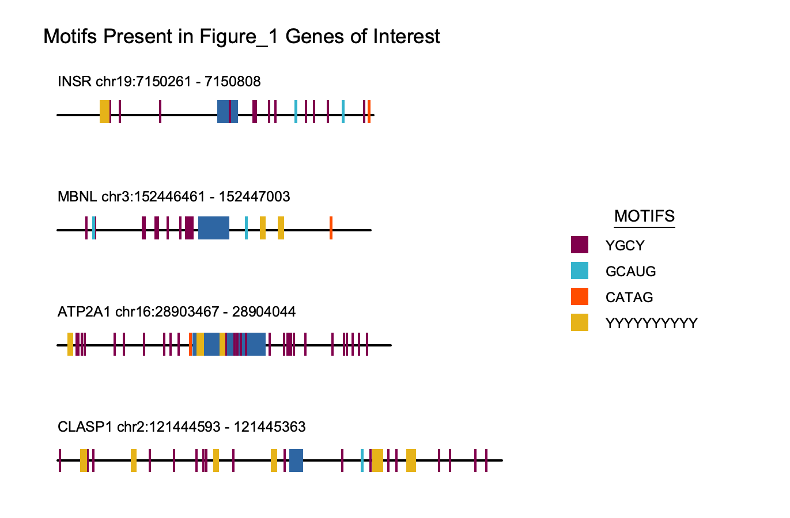

#Motif Marker for Sequences

Motif mark takes in motifs of interest and sequences in the form of a fasta file and produces a PNG depicting the sequences from the fasta file to scale with the motifs of interest labeled on the sequence. Exons will appear in the sequence as boxes and introns as a line. Motifs are color coded and to scale.

###Inputs

Motif mark takes in two arguments:
 1. A filepath to a traditionally formatted fasta file with the suffix ".fasta".
 2. A filepath to the motifs file, a .txt file with one motif of interest per line. Motifs can include ambiguous IUPAC characters such as Y which can represent C or T nucleotides.

###Example of Motif Mark Output:

